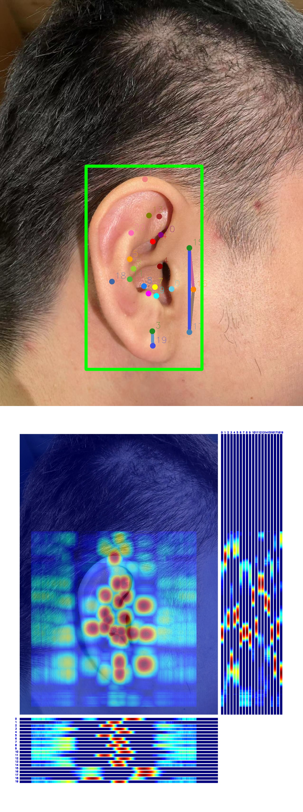

# OpenMMLabCamp-homework1
as a homework on OpenMMLab course.
this time homework is a pose detection on ear.
we using rtmnet as out method.

# OpenMMLabCamp-homework1

## intro

as a homework on OpenMMLab course.
this time homework is a pose detection on ear.
we using rtmnet as out method.
## prework
if you really need to use this, you need to install opendetection firstly.
you can follow some menu to install it.
## inference

<div style="display:flex;">
  
  
</div>

## inference way
this is how to inference. but you need to change the position of config.py & ckpt file.
```shell
python demo/topdown_demo_with_mmdet.py ../mmdetection/rtmdet_tiny_ear.py ../mmdetection/checkpoint/best_coco_bbox_mAP_epoch_197.pth rtmpose-s-ear.py checkpoint/best_PCK_epoch_300.pth --input ../ear.jpg --output-root outputs/e2e_pose --device cuda:0 --bbox-thr 0.5 --kpt-thr 0.5 --nms-thr 0.3 --radius 12 --thickness 12 --draw-bbox --draw-heatmap --show-kpt-idx
