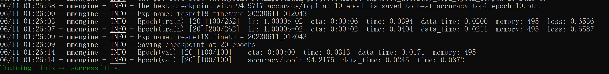

# OpenMMLabCamp-homework2

## intro
as a homework on OpenMMLab course. this time homework is using a pretrain model of ResNet18 to classification the fruit


## prework
this time, we need to divide the dataset by ourself, we using divide.py to divide the dataset to train && val

## training
```
mim train mmpretrain resnet18_finetune.py --work-dir=./exp
```
## config && result
I use epoch = 20.


