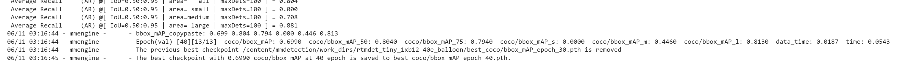
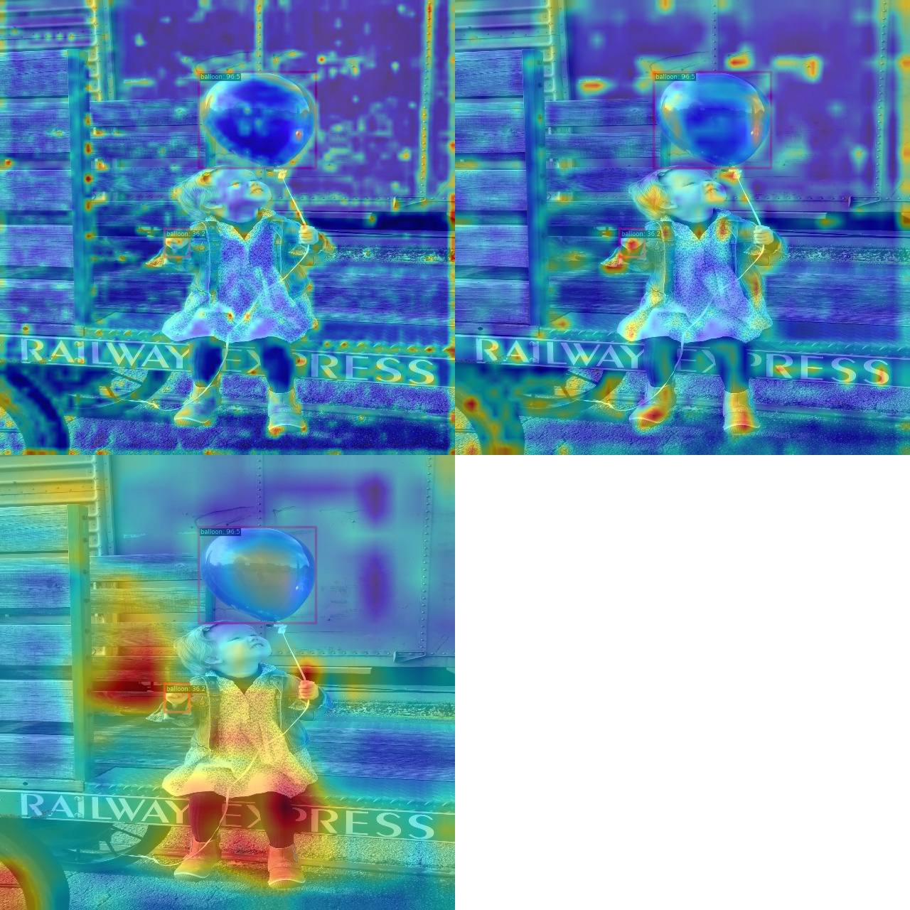
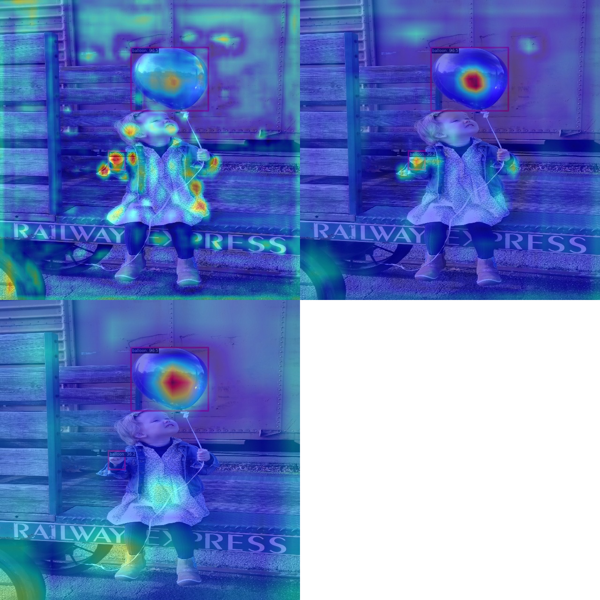
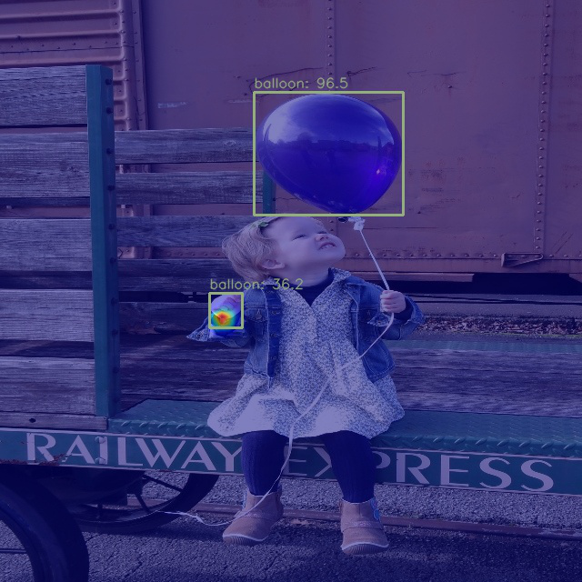

# OpenMMLabCamp-homework3

[]([https://colab.research.google.com/drive/XXXXXXX](https://colab.research.google.com/drive/156tR2wQr06HrOERktEcyLkZHMh8syk6e#scrollTo=BiqE6H1ufo1z))

## preview

this time homework is use the rtmdet to detect the ballon.

## data preprocess

using label2coco.py to trans the label.

## config

see rtmdet_tiny_1xb12-40e_ballon.py

## train
```
!python tools/train.py rtmdet_tiny_1xb12-40e_balloon.py
```
## train result



## test
```
!python tools/test.py rtmdet_tiny_1xb12-40e_balloon.py work_dirs/rtmdet_tiny_1xb12-40e_balloon/best_coco/bbox_mAP_epoch_40.pth --show-dir results
```

## result




