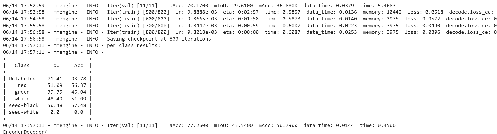
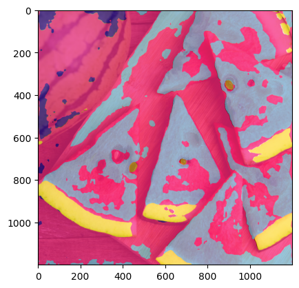

# OpenMMLabCamp-homework4

[]([https://colab.research.google.com/drive/XXXXXXX]([https://colab.research.google.com/drive/156tR2wQr06HrOERktEcyLkZHMh8syk6e#scrollTo=BiqE6H1ufo1z](https://colab.research.google.com/drive/1kJrSaihxCiZalLN8gW_ASm6OAQpkECFz#scrollTo=-CsMqYpv8mO-)))

## preview

this time homework is use the pspnet to seg the watermelon.

## data preprocess

using this to add dataset
```
# mmsegmentation/mmseg/datasets/WatermelonDataset.py
from mmseg.registry import DATASETS
from mmseg.datasets import BaseSegDataset

@DATASETS.register_module()
class WatermelonDataset(BaseSegDataset):
    # 类别和对应的可视化配色
    METAINFO = {
        # 按照灰度排序 0 1 2 3 4 5
        'classes':['Unlabeled', 'red', 'green', 'white', 'seed-black', 'seed-white'],
        'palette':[[132,41,246], [228,193,110], [152,16,60], [58,221,254], [41,169,226], [155,155,155]]
    }
    
    # 指定图像扩展名、标注扩展名
    def __init__(self,
                 img_suffix='.jpg',
                 seg_map_suffix='.png',
                 reduce_zero_label=False, # 类别ID为0的类别是否需要除去
                 **kwargs) -> None:
        super().__init__(
            img_suffix=img_suffix,
            seg_map_suffix=seg_map_suffix,
            reduce_zero_label=reduce_zero_label,
            **kwargs)
```

## config

see pspnet-WatermelonDataset_20230614.py

## train
```
runner.train()
```
## train result




## result



