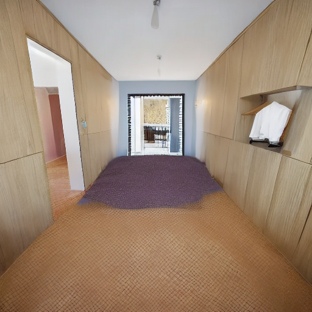

# OpenMMLabCamp-homework4

))

## preview

this time homework is use the controlnet to generation pic.

## data preprocess

download any pic from Google.
and do a canny trans.

## config

see MMagic.ipynb

## train

we just use pretrain model in this course.

## result

